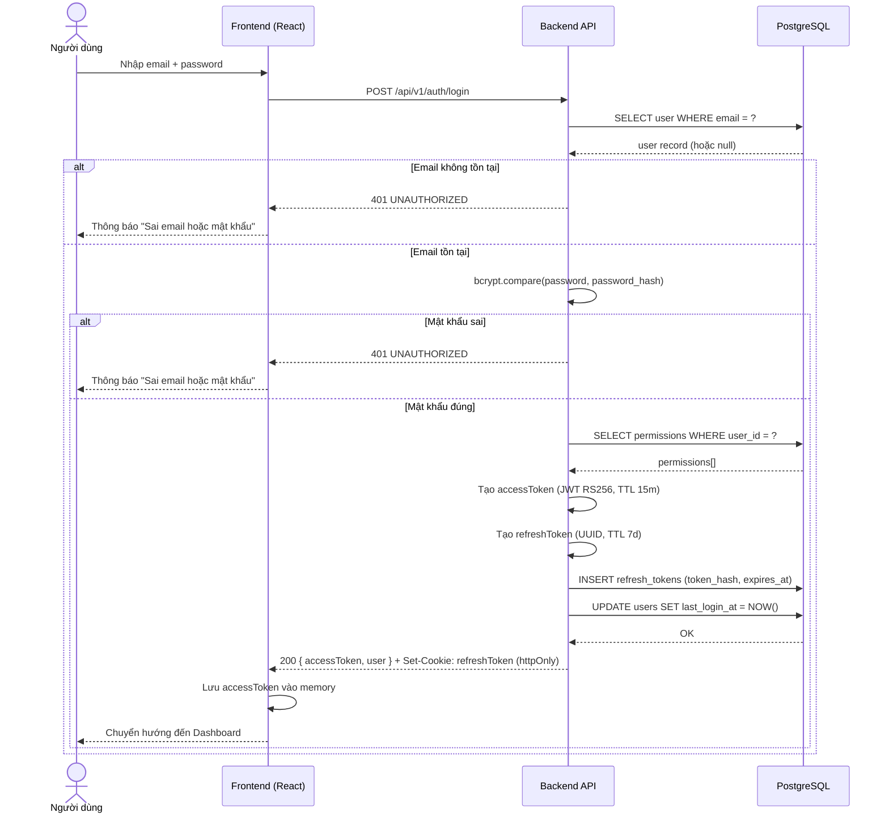
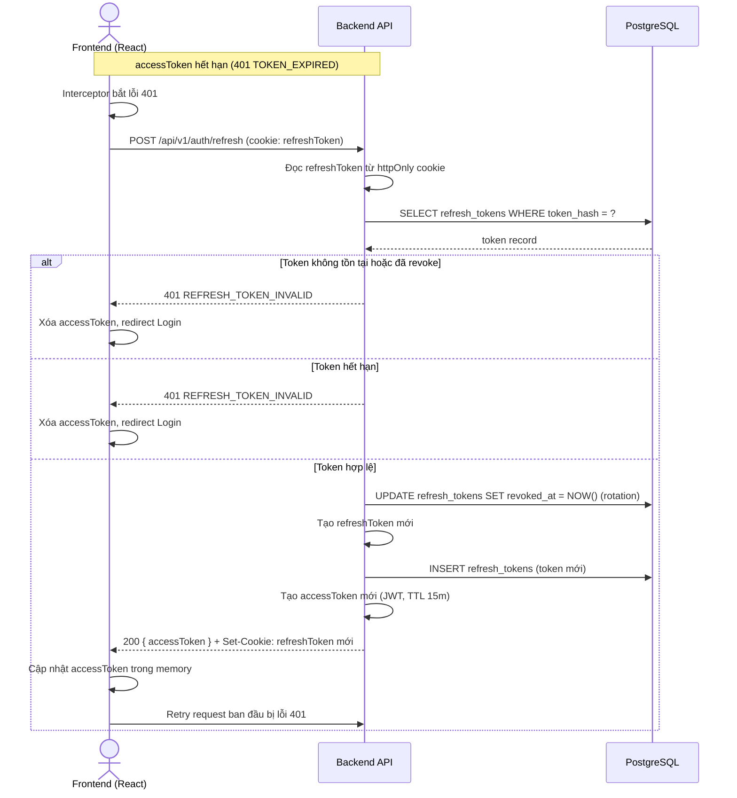
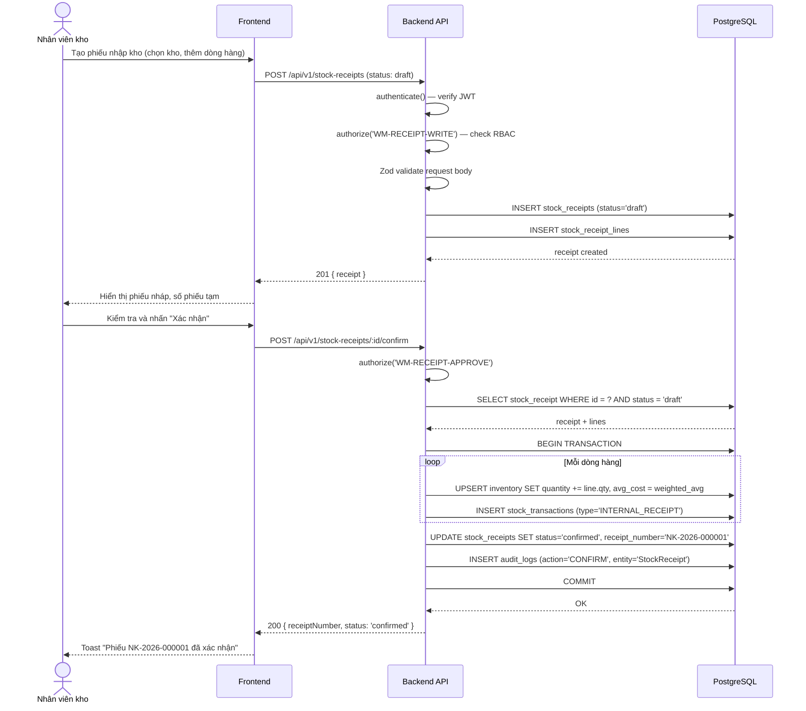
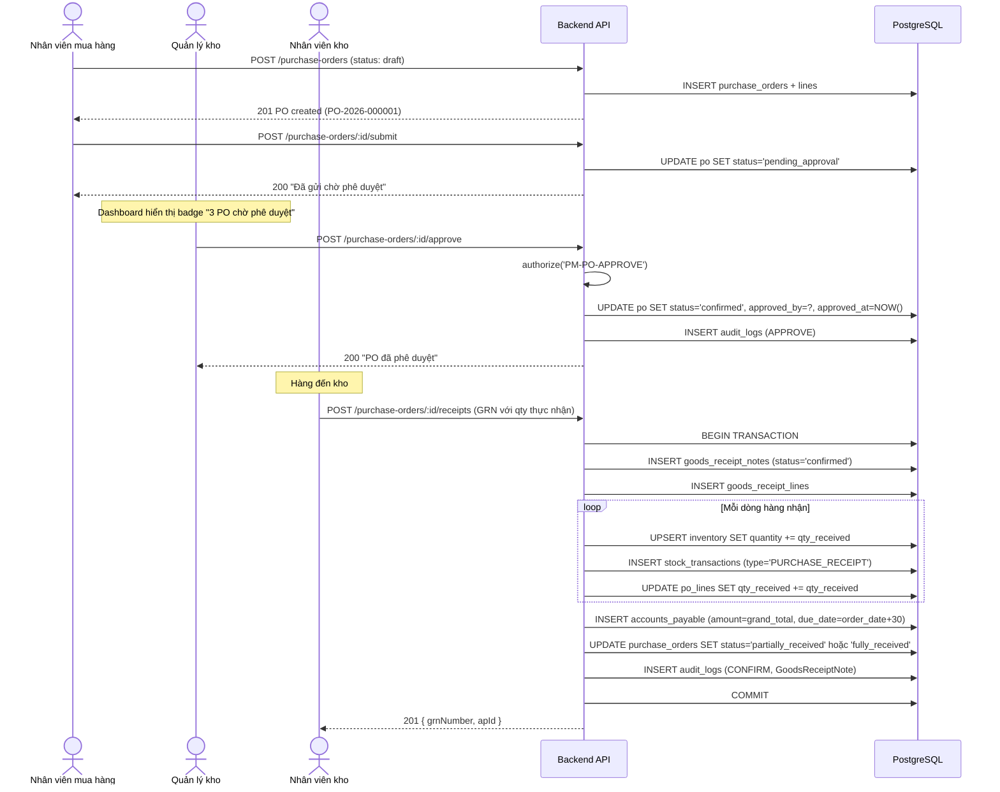
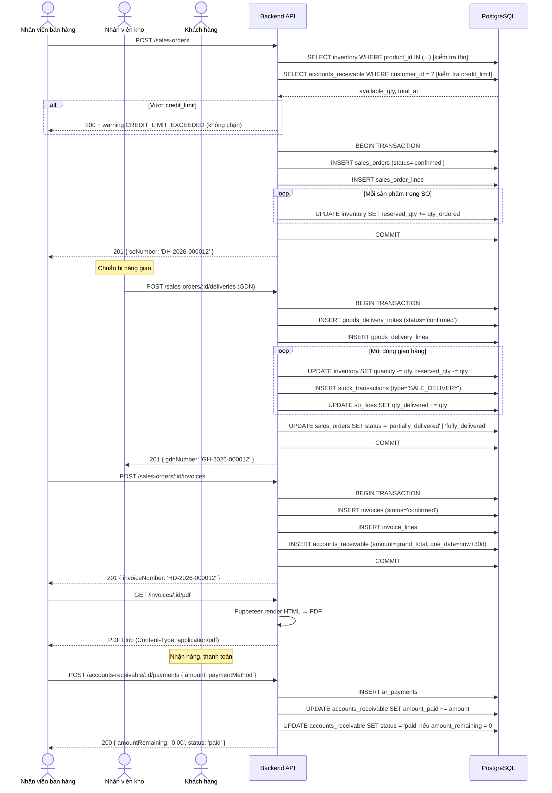
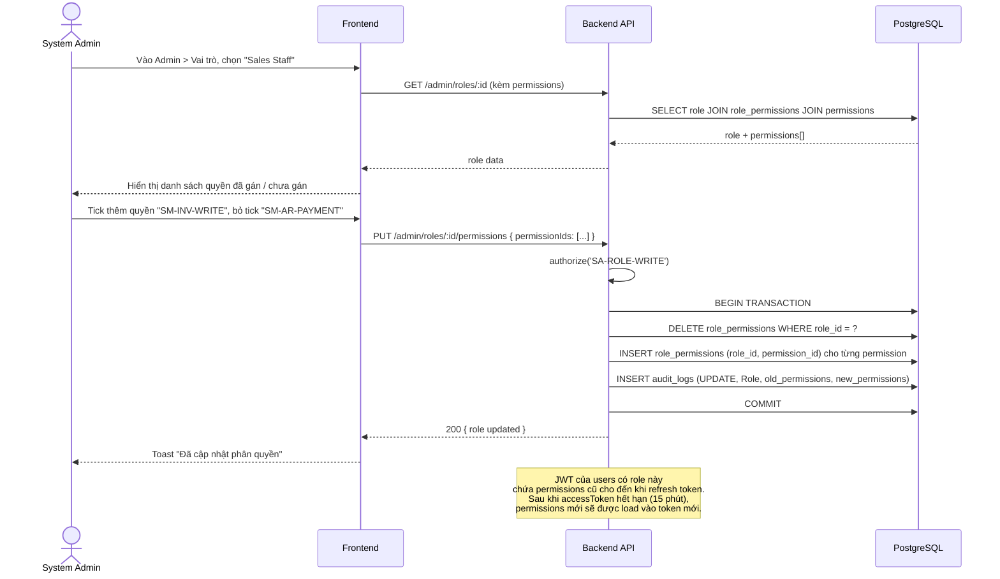

# System Architecture Document
# Tài liệu Kiến trúc Hệ thống — WSMS v1.0

**Document ID:** WSMS-ARCH-v1.0  
**Version:** 1.0  
**Date:** 2026-06-23  
**Liên quan:** [SRS.md](../SRS.md)

---

## Table of Contents

1. [Tổng quan kiến trúc](#1-tổng-quan-kiến-trúc)
2. [Kiến trúc phân tầng (Layered Architecture)](#2-kiến-trúc-phân-tầng)
3. [Component Diagram](#3-component-diagram)
4. [Deployment Diagram](#4-deployment-diagram)
5. [Luồng dữ liệu (Data Flow)](#5-luồng-dữ-liệu)
6. [Sequence Diagrams](#6-sequence-diagrams)
7. [Kiến trúc bảo mật](#7-kiến-trúc-bảo-mật)
8. [Chiến lược Caching](#8-chiến-lược-caching)
9. [Xử lý lỗi & Logging](#9-xử-lý-lỗi--logging)

---

## 1. Tổng quan kiến trúc

WSMS được xây dựng theo mô hình **3-tier web application**:

| Tier | Thành phần | Công nghệ |
|------|-----------|-----------|
| Presentation | SPA Frontend | React + TypeScript |
| Application | REST API Backend | Node.js + Express + TypeScript |
| Data | Relational Database | PostgreSQL 15 |

**Nguyên tắc kiến trúc:**
- **Separation of Concerns** — Frontend và Backend tách biệt hoàn toàn, giao tiếp qua REST API.
- **Stateless API** — Backend không lưu session; trạng thái xác thực nằm trong JWT.
- **Single Source of Truth** — Mọi nghiệp vụ và kiểm tra dữ liệu thực hiện tại Backend; Frontend chỉ hiển thị.
- **Defense in Depth** — Phân quyền được kiểm tra ở tầng API, không phụ thuộc Frontend.
- **ACID Transactions** — Mọi giao dịch thay đổi tồn kho/tài chính phải atomic.

---

## 2. Kiến trúc phân tầng

```
┌─────────────────────────────────────────────────────────────────┐
│                     PRESENTATION TIER                           │
│                                                                 │
│   ┌───────────────────────────────────────────────────────┐    │
│   │              React SPA (Browser)                      │    │
│   │  ┌──────────┐ ┌──────────┐ ┌──────────┐ ┌─────────┐  │    │
│   │  │  Pages   │ │Components│ │  Stores  │ │ API     │  │    │
│   │  │ (Routes) │ │  (UI)    │ │ (State)  │ │ Client  │  │    │
│   │  └──────────┘ └──────────┘ └──────────┘ └─────────┘  │    │
│   └───────────────────────────────────────────────────────┘    │
└─────────────────────────┬───────────────────────────────────────┘
                          │ HTTPS / REST / JSON
┌─────────────────────────▼───────────────────────────────────────┐
│                     APPLICATION TIER                            │
│                                                                 │
│   ┌───────────────────────────────────────────────────────┐    │
│   │                 Express.js Server                     │    │
│   │  ┌────────────┐  ┌────────────┐  ┌────────────────┐  │    │
│   │  │  Routers   │  │Middlewares │  │ Error Handler  │  │    │
│   │  │ /api/v1/.. │  │ Auth, RBAC │  │                │  │    │
│   │  └─────┬──────┘  └────────────┘  └────────────────┘  │    │
│   │        │                                               │    │
│   │  ┌─────▼──────────────────────────────────────────┐   │    │
│   │  │              Service Layer                     │   │    │
│   │  │  ┌──────┐ ┌──────┐ ┌──────┐ ┌──────┐ ┌─────┐ │   │    │
│   │  │  │  WM  │ │  PM  │ │  SM  │ │  RP  │ │  SA │ │   │    │
│   │  │  │ Svc  │ │ Svc  │ │ Svc  │ │ Svc  │ │ Svc │ │   │    │
│   │  │  └──────┘ └──────┘ └──────┘ └──────┘ └─────┘ │   │    │
│   │  └─────────────────────────────────────────────────┘   │    │
│   │        │                                               │    │
│   │  ┌─────▼──────────────────────────────────────────┐   │    │
│   │  │           Repository / Data Access Layer       │   │    │
│   │  │            (Prisma ORM Client)                 │   │    │
│   │  └────────────────────────────────────────────────┘   │    │
│   └───────────────────────────────────────────────────────┘    │
└─────────────────────────┬───────────────────────────────────────┘
                          │ SQL / TCP
┌─────────────────────────▼───────────────────────────────────────┐
│                       DATA TIER                                 │
│                                                                 │
│   ┌──────────────────────┐   ┌─────────────────────────────┐   │
│   │    PostgreSQL 15      │   │   File Storage (Local/S3)   │   │
│   │  (Primary Database)  │   │   (PDF exports, uploads)    │   │
│   └──────────────────────┘   └─────────────────────────────┘   │
└─────────────────────────────────────────────────────────────────┘
```

### 2.1 Presentation Layer (Frontend)

| Phần | Mô tả |
|------|-------|
| **Pages / Routes** | Mỗi module (WM, PM, SM, RP, SA) có tập pages riêng. React Router quản lý điều hướng |
| **Components** | UI components tái sử dụng: DataTable, Form, Modal, Toast, Sidebar... |
| **State Management** | TanStack Query (React Query) cho server state; Zustand cho client-side global state |
| **API Client** | Axios instance với interceptor tự động gắn JWT header và refresh token khi hết hạn |
| **Form Handling** | React Hook Form + Zod validation |

### 2.2 Application Layer (Backend)

| Phần | Mô tả |
|------|-------|
| **Router Layer** | Express Router nhận request, validate schema đầu vào (Zod), gọi Service |
| **Middleware** | `authenticate` (verify JWT), `authorize(permission)` (RBAC check), `rateLimiter`, `requestLogger` |
| **Service Layer** | Business logic thuần túy; không phụ thuộc HTTP. Mỗi module có Service class riêng |
| **Repository Layer** | Prisma Client wrapper; tất cả truy vấn database tập trung tại đây |
| **Audit Logger** | AuditService ghi log sau mỗi thao tác quan trọng |

### 2.3 Data Layer

| Phần | Mô tả |
|------|-------|
| **PostgreSQL** | Primary database; lưu toàn bộ dữ liệu nghiệp vụ |
| **Prisma ORM** | Schema-first ORM; type-safe queries; migrations tự động |
| **File Storage** | Local filesystem (dev) hoặc S3-compatible object storage (production) cho PDF/Excel exports |

---

## 3. Component Diagram

### 3.1 Backend Module Structure

```
src/
├── server.ts                  # Entry point, khởi động Express app
├── app.ts                     # Express app setup, middlewares, routes
├── config/
│   ├── env.ts                 # Đọc và validate biến môi trường
│   └── database.ts            # Prisma client singleton
├── middlewares/
│   ├── authenticate.ts        # Verify JWT, gắn user vào req
│   ├── authorize.ts           # Kiểm tra RBAC permission
│   ├── rateLimiter.ts         # Rate limiting
│   ├── requestLogger.ts       # HTTP request logging
│   └── errorHandler.ts        # Global error handler
├── modules/
│   ├── auth/
│   │   ├── auth.router.ts
│   │   ├── auth.service.ts
│   │   └── auth.schema.ts     # Zod validation schemas
│   ├── master-data/
│   │   ├── product/
│   │   │   ├── product.router.ts
│   │   │   ├── product.service.ts
│   │   │   ├── product.repository.ts
│   │   │   └── product.schema.ts
│   │   ├── category/
│   │   ├── warehouse/
│   │   └── uom/
│   ├── warehouse/
│   │   ├── stock-receipt/
│   │   ├── stock-issue/
│   │   ├── stock-transfer/
│   │   └── stock-taking/
│   ├── purchase/
│   │   ├── supplier/
│   │   ├── purchase-order/
│   │   ├── goods-receipt/
│   │   └── payables/
│   ├── sales/
│   │   ├── customer/
│   │   ├── quotation/
│   │   ├── sales-order/
│   │   ├── invoice/
│   │   └── receivables/
│   ├── reports/
│   │   ├── inventory/
│   │   ├── stock-movement/
│   │   ├── sales/
│   │   ├── purchase/
│   │   └── dashboard/
│   └── admin/
│       ├── user/
│       ├── role/
│       ├── config/
│       └── audit-log/
├── shared/
│   ├── errors/                # Custom error classes (AppError, NotFoundError, ...)
│   ├── utils/                 # Helpers: pagination, date, number formatting
│   ├── types/                 # Shared TypeScript types
│   └── services/
│       ├── email.service.ts   # SMTP email
│       ├── pdf.service.ts     # PDF generation
│       └── excel.service.ts   # Excel export
└── prisma/
    ├── schema.prisma          # Database schema
    └── migrations/            # Migration files
```

### 3.2 Frontend Module Structure

```
src/
├── main.tsx                   # React entry point
├── App.tsx                    # Router setup, providers
├── lib/
│   ├── api.ts                 # Axios instance, interceptors
│   ├── auth.ts                # JWT decode, token storage
│   └── utils.ts               # Shared utilities
├── store/
│   ├── authStore.ts           # User info, permissions (Zustand)
│   └── uiStore.ts             # Sidebar state, theme (Zustand)
├── components/
│   ├── ui/                    # Base UI (shadcn/ui)
│   ├── layout/
│   │   ├── Sidebar.tsx
│   │   ├── Header.tsx
│   │   └── PageLayout.tsx
│   └── shared/
│       ├── DataTable.tsx      # Generic table với search/filter/pagination
│       ├── FormFields.tsx     # Reusable form field components
│       ├── StatusBadge.tsx    # Trạng thái chứng từ
│       └── ConfirmDialog.tsx  # Hộp thoại xác nhận hủy/xóa
├── pages/
│   ├── auth/
│   │   └── LoginPage.tsx
│   ├── dashboard/
│   │   └── DashboardPage.tsx
│   ├── master-data/
│   │   ├── products/
│   │   ├── categories/
│   │   ├── warehouses/
│   │   └── uom/
│   ├── warehouse/
│   │   ├── stock-receipt/
│   │   ├── stock-issue/
│   │   ├── stock-transfer/
│   │   └── stock-taking/
│   ├── purchase/
│   │   ├── suppliers/
│   │   ├── purchase-orders/
│   │   ├── goods-receipts/
│   │   └── payables/
│   ├── sales/
│   │   ├── customers/
│   │   ├── quotations/
│   │   ├── sales-orders/
│   │   ├── invoices/
│   │   └── receivables/
│   ├── reports/
│   └── admin/
└── hooks/
    ├── useAuth.ts             # Kiểm tra permission, redirect
    ├── useProducts.ts         # TanStack Query hooks cho Products
    └── ...                   # 1 hook file per resource
```

---

## 4. Deployment Diagram

### 4.1 Môi trường phát triển (Development)

```
Developer Machine
├── Frontend Dev Server   (Vite, port 5173)
├── Backend Dev Server    (ts-node-dev, port 3000)
├── PostgreSQL            (Docker container, port 5432)
└── pgAdmin               (Docker container, port 5050)
```

### 4.2 Môi trường sản xuất (Production — On-Premise / VPS)

```
┌─────────────────────────────────────────────────────────────┐
│                    VPS / On-Premise Server                  │
│                                                             │
│  ┌────────────────────────────────────────────────────┐    │
│  │              Nginx (Reverse Proxy)                 │    │
│  │  Port 80 → redirect HTTPS                         │    │
│  │  Port 443 → serve static + proxy API              │    │
│  └───────────────┬────────────────┬───────────────────┘    │
│                  │                │                         │
│    ┌─────────────▼──────┐  ┌──────▼─────────────────┐     │
│    │  Static Files      │  │  Node.js API Server    │     │
│    │  (React build)     │  │  (PM2, port 3000)      │     │
│    │  /var/www/wsms/    │  │  Cluster mode          │     │
│    └────────────────────┘  └──────┬─────────────────┘     │
│                                   │                         │
│                     ┌─────────────▼──────────────────┐     │
│                     │     PostgreSQL 15               │     │
│                     │     (localhost:5432)            │     │
│                     │     Data: /var/lib/postgresql/  │     │
│                     └────────────────────────────────┘     │
│                                                             │
│  ┌─────────────────────────────────────────────────────┐   │
│  │              System Services                        │   │
│  │  ├── pg_dump cron (daily backup, retain 30 days)   │   │
│  │  ├── Certbot (Let's Encrypt SSL auto-renew)        │   │
│  │  └── PM2 (process manager, auto-restart)          │   │
│  └─────────────────────────────────────────────────────┘   │
└─────────────────────────────────────────────────────────────┘

                    │ SMTP
         ┌──────────▼──────────┐
         │  Email Service      │
         │  (Gmail / SendGrid) │
         └─────────────────────┘
```

**Nginx config pattern:**
```nginx
server {
    listen 443 ssl;
    server_name wsms.example.com;

    # Serve React SPA
    location / {
        root /var/www/wsms;
        try_files $uri $uri/ /index.html;
    }

    # Proxy API calls
    location /api/ {
        proxy_pass http://localhost:3000;
        proxy_set_header X-Real-IP $remote_addr;
    }
}
```

### 4.3 Docker Compose (Development)

```yaml
# docker-compose.yml
services:
  postgres:
    image: postgres:15-alpine
    environment:
      POSTGRES_DB: wsms_dev
      POSTGRES_USER: wsms
      POSTGRES_PASSWORD: wsms_dev_pass
    ports:
      - "5432:5432"
    volumes:
      - postgres_data:/var/lib/postgresql/data

  pgadmin:
    image: dpage/pgadmin4
    environment:
      PGADMIN_DEFAULT_EMAIL: admin@wsms.local
      PGADMIN_DEFAULT_PASSWORD: admin
    ports:
      - "5050:80"

volumes:
  postgres_data:
```

---

## 5. Luồng dữ liệu

### 5.1 Luồng xác thực (Authentication Flow)

```
Client                          API Server                    DB
  │                                 │                          │
  │──── POST /api/v1/auth/login ───>│                          │
  │     { email, password }         │                          │
  │                                 │──── SELECT user ────────>│
  │                                 │<─── user record ─────────│
  │                                 │                          │
  │                                 │ bcrypt.compare()         │
  │                                 │ generate accessToken (15m)│
  │                                 │ generate refreshToken (7d)│
  │                                 │──── INSERT refresh_token >│
  │                                 │                          │
  │<── 200 { accessToken,           │                          │
  │          refreshToken,          │                          │
  │          user: {...} }          │                          │
  │                                 │                          │
  │ (Lưu accessToken trong memory,  │                          │
  │  refreshToken trong httpOnly    │                          │
  │  cookie)                        │                          │
  │                                 │                          │
  │──── GET /api/v1/products ──────>│                          │
  │     Authorization: Bearer <AT>  │                          │
  │                                 │ verify JWT               │
  │                                 │ check permission RBAC    │
  │<─── 200 { data: [...] } ────────│                          │
```

### 5.2 Luồng xác nhận phiếu nhập kho (WM-001)

```
Client                    API Server                      DB
  │                           │                            │
  │── POST /stock-receipts ──>│                            │
  │   { warehouseId,          │                            │
  │     lines: [...] }        │ authenticate()             │
  │                           │ authorize('WM-RECEIPT-WRITE')
  │                           │ validate Zod schema        │
  │                           │                            │
  │                           │──── BEGIN TRANSACTION ────>│
  │                           │                            │
  │                           │── INSERT StockReceipt ────>│
  │                           │── INSERT StockReceiptLines>│
  │                           │                            │
  │                           │ (khi xác nhận):            │
  │                           │── UPDATE Inventory ────────│
  │                           │   quantity += line.qty     │
  │                           │── INSERT StockTransaction >│
  │                           │   type='RECEIPT_IN'        │
  │                           │── INSERT AuditLog ─────────│
  │                           │                            │
  │                           │──── COMMIT ───────────────>│
  │                           │                            │
  │<── 201 { receipt } ───────│                            │
```

### 5.3 Luồng tạo đơn bán hàng và xuất kho (SM-003 → SM-004)

```
[Tạo Sales Order]
SALES Staff ──> POST /sales-orders
                │ Kiểm tra tồn kho khả dụng (available_qty)
                │ Kiểm tra credit_limit khách hàng
                │ UPDATE Inventory.reserved_qty += qty
                │ INSERT SalesOrder + SalesOrderLines
                └──> 201 { so }

[Tạo GDN & Invoice]
SALES Staff ──> POST /sales-orders/:id/deliver
                │ INSERT GoodsDeliveryNote
                │ INSERT GoodsDeliveryLines
                │ UPDATE Inventory:
                │   quantity -= qty_delivered
                │   reserved_qty -= qty_delivered
                │ INSERT StockTransaction (type='SALE_OUT')
                │ INSERT Invoice
                │ INSERT InvoiceLines
                │ INSERT AccountsReceivable
                └──> 201 { gdn, invoice }
```

---

## 6. Sequence Diagrams

> Tất cả diagram sử dụng cú pháp **Mermaid** — render tự động trên GitHub, GitLab, VS Code (Markdown Preview Mermaid Support extension).

---

### 6.1 Authentication — Đăng nhập & Cấp Token



---

### 6.2 Authentication — Refresh Access Token



---

### 6.3 Warehouse — Xác nhận Phiếu nhập kho (WM-001)



---

### 6.4 Purchase — Luồng mua hàng đầy đủ (PM-002 → PM-004)



---

### 6.5 Sales — Luồng bán hàng đầy đủ (SM-003 → SM-004 → SM-006)



---

### 6.6 Reports — Xuất báo cáo Excel (RP-002)

```mermaid
sequenceDiagram
    actor User as Người dùng
    participant FE as Frontend
    participant API as Backend API
    participant DB as PostgreSQL

    User->>FE: Chọn khoảng ngày, kho, nhấn "Xuất Excel"
    FE->>API: GET /reports/stock-movement?fromDate=2026-06-01&toDate=2026-06-23&format=excel
    API->>API: authorize('RP-ALL-READ')
    API->>DB: SELECT stock_transactions JOIN products JOIN warehouses WHERE date BETWEEN ? AND ?
    DB-->>API: rows[]

    Note over API: ExcelJS build workbook
    API->>API: Tạo worksheet "Nhập xuất tồn"
    API->>API: Thêm header row (đậm, màu nền)
    API->>API: Thêm dữ liệu từng dòng
    API->>API: Thêm row tổng cộng
    API->>API: Set column widths
    API->>API: Buffer.from(workbook.xlsx.writeBuffer())

    API-->>FE: 200 xlsx binary (Content-Disposition: attachment; filename=stock-movement-2026-06.xlsx)
    FE->>FE: Tạo Blob URL, trigger download
    FE-->>User: File Excel tải về
```

---

### 6.7 Admin — Phân quyền RBAC (SA-002)



---

## 7. Kiến trúc bảo mật

### 6.1 Authentication

```
┌──────────────────────────────────────────────────────┐
│                  Token Strategy                      │
│                                                      │
│  Access Token (JWT)                                  │
│  ├── TTL: 15 phút                                   │
│  ├── Lưu: JavaScript memory (không localStorage)    │
│  ├── Payload: { sub, email, permissions[] }         │
│  └── Signing: RS256 (RSA private key)               │
│                                                      │
│  Refresh Token                                       │
│  ├── TTL: 7 ngày                                    │
│  ├── Lưu: httpOnly cookie (SameSite=Strict)         │
│  ├── Lưu DB: bảng refresh_tokens (để revoke)        │
│  └── Rotation: mỗi lần refresh tạo token mới       │
└──────────────────────────────────────────────────────┘
```

### 6.2 Authorization (RBAC)

```typescript
// Middleware pattern
router.get('/products', authenticate, authorize('MD-PRODUCT-READ'), handler)
router.post('/products', authenticate, authorize('MD-PRODUCT-WRITE'), handler)

// authorize() middleware
function authorize(permission: string) {
  return (req, res, next) => {
    const userPermissions = req.user.permissions  // từ JWT payload
    if (!userPermissions.includes(permission)) {
      throw new ForbiddenError('Không có quyền thực hiện thao tác này')
    }
    next()
  }
}
```

### 6.3 Input Validation

Toàn bộ request body và query params được validate bằng **Zod** tại Router layer trước khi vào Service:

```typescript
// Ví dụ: Tạo sản phẩm
const createProductSchema = z.object({
  body: z.object({
    sku: z.string().min(1).max(50).regex(/^[A-Z0-9_-]+$/),
    name: z.string().min(1).max(200),
    categoryId: z.string().uuid(),
    baseUomId: z.string().uuid(),
    salePrice: z.number().nonnegative(),
    minStockQty: z.number().nonneg().default(0),
  })
})
```

### 6.4 SQL Injection Prevention

Toàn bộ truy vấn database thông qua **Prisma ORM** với parameterized queries — không có string concatenation SQL thủ công.

### 6.5 Rate Limiting

```
POST /auth/login: 10 requests/minute/IP (chống brute force)
POST /auth/refresh: 20 requests/minute/IP
Các endpoint khác: 200 requests/minute/user
```

---

## 8. Chiến lược Caching

**WSMS v1.0 không triển khai distributed cache (Redis)** — đơn giản hóa cho SME.

| Loại cache | Cách thực hiện |
|------------|----------------|
| **In-memory cache (Server)** | Cache danh mục ít thay đổi (UoM, ProductCategory, SystemConfig) trong Node.js process memory với TTL 5 phút |
| **HTTP Cache-Control** | API trả `Cache-Control: no-store` cho dữ liệu nghiệp vụ; `max-age=300` cho dữ liệu danh mục |
| **Database Query Optimization** | Index đầy đủ trên FK và cột lọc; query plan review cho báo cáo |

*Redis sẽ được xem xét ở v2.0 khi scale lên > 200 concurrent users.*

---

## 9. Xử lý lỗi & Logging

### 8.1 Error Response Format

Tất cả lỗi API trả về cùng một format:

```json
{
  "success": false,
  "error": {
    "code": "VALIDATION_ERROR",
    "message": "Dữ liệu đầu vào không hợp lệ",
    "details": [
      { "field": "sku", "message": "SKU không được để trống" }
    ]
  },
  "requestId": "req_abc123"
}
```

### 8.2 HTTP Status Codes

| Code | Trường hợp sử dụng |
|------|-------------------|
| 200 | Thành công (GET, PUT, PATCH) |
| 201 | Tạo mới thành công (POST) |
| 204 | Xóa/hủy thành công, không có body |
| 400 | Dữ liệu đầu vào không hợp lệ (Validation Error) |
| 401 | Chưa xác thực (token thiếu hoặc hết hạn) |
| 403 | Không có quyền (RBAC) |
| 404 | Không tìm thấy tài nguyên |
| 409 | Conflict (SKU đã tồn tại, v.v.) |
| 422 | Lỗi nghiệp vụ (tồn kho không đủ, v.v.) |
| 500 | Lỗi server nội bộ |

### 8.3 Application Logging

Sử dụng **Pino** (structured JSON logging):

```
Level: error  → Lỗi server, database errors, uncaught exceptions
Level: warn   → Business rule violations, rate limit hits
Level: info   → HTTP requests, service lifecycle events
Level: debug  → SQL queries (chỉ dev environment)
```

Log được ghi vào:
- **stdout** (PM2 capture, xem bằng `pm2 logs`)
- **File** `/var/log/wsms/app-YYYY-MM-DD.log` (rotate hàng ngày, giữ 30 ngày)

### 8.4 Audit Log

Mọi thao tác CRUD quan trọng ghi vào bảng `audit_logs`:

```typescript
// AuditService được gọi trong Service layer
await auditService.log({
  userId: req.user.id,
  action: 'CONFIRM',
  module: 'WM',
  entityType: 'StockReceipt',
  entityId: receipt.id,
  oldValues: null,
  newValues: receipt,
})
```
